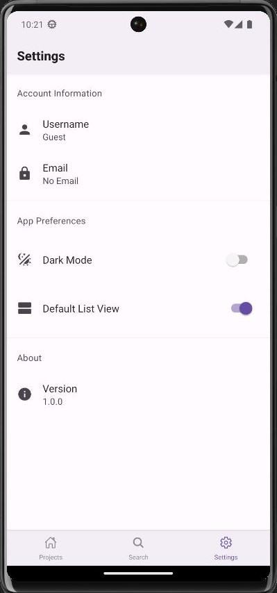
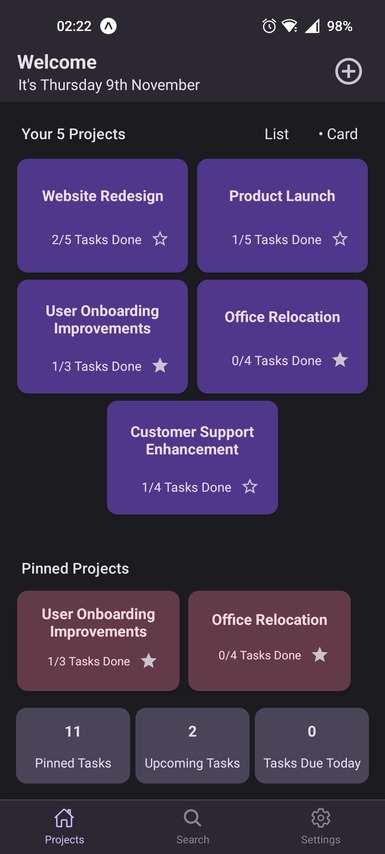

# To Do List

A to do list app for Android and IOS. Built using react native and expo. The react-native-paper library was used for the ui. A full list of dependancies is available in the file "package-lock.json".

Demo Video: https://drive.google.com/file/d/11gUaws_dlMwSYSmsD1c6GEVjs1G-eBLq/view?usp=sharing

## Homescreen

The user can create projects which can each contain a series of tasks. The projects are viewed on the home screen and can be pinned so that they are more easily accessible.

The user has the option to choose how projects are viewed on the homescreen(either list or card view). The default view can be specified in the settings screen.

A new project can be created by clicking on the plus button in the top right of the screen.

## Project Screen

After selecting a project, it is displayed on a new screen. All tasks are displayed in a scrollable list. Lines are displayed on the screen to mimic the lines on a physical paper. This is done to make the interface more visually appealing.

Each task can be marked as favourite and/or marked as complete. A small animation is played for both actions. 

A task can be clicked on to expand it and see more detailed information about it(such as its description). When a task is expanded, a button to edit the task is shown. An animation is played when a task is being expaned.

A new task can be created by pressing the floating plus button in the bottom right of the screen. The dotted line in the top right of the screen opens a menu which gives the user the ability to rename or delete the project.

## Search Screen

A search screen is opened if the search icon in the bottom navigator is pressed. The user can search for both projects and tasks. The results will include tasks which have a title that matches the search query and/or contains the search query in the task description. The results highlight what word matches the search query. The results can be pressed to open their relevant project.

## Settings Screen

The settings screen allows the user to change between a light theme and a dark theme. This is where the default view style for the projects on the home screen is also chosen(list or card view). The username and email fields are placeholders for a possible future backend integration, allowing the user to create an account. The theme updates live, as soon as the user toggles the switch, therefore not requiring a restart. The settings are persistent, meaning that they are saved and loaded when the application starts.

## Dark Theme

